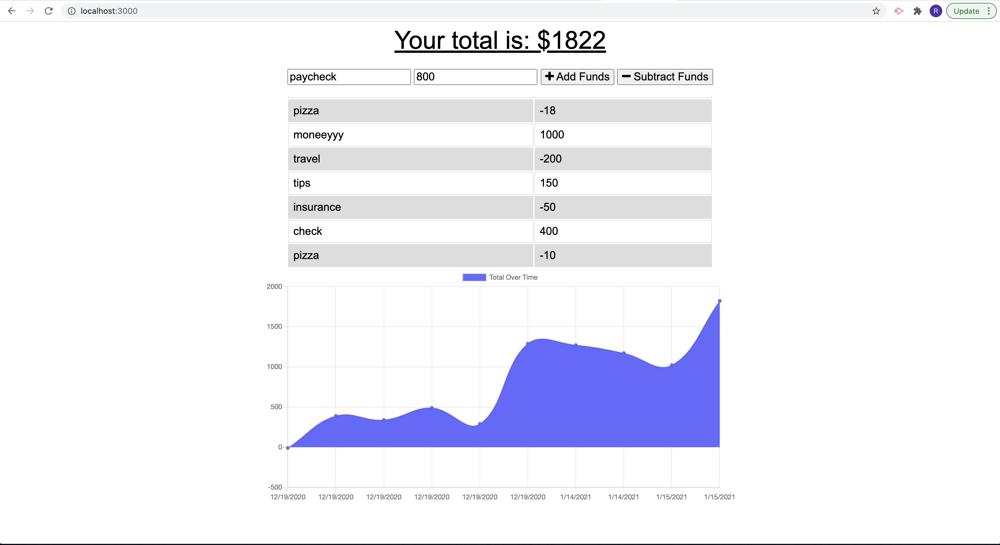

# budget-tracker

## Table of Content: 
#### (Link to Github Repo) [https://github.com/mazzeiroman/budget-tracker]
- [Description](#description)
- [Installation](#installation)
- [Usage](#usage)
- [Contributing](#Contributing)
- [Tests](#tests)
- [License](#license)
- [Questions](#Questions)
- [Credits](#credits)

## Link to Github Repo
https://github.com/mazzeiroman/budget-tracker

## Link to the Deployed Application
https://budgetbyte.herokuapp.com/

 

## Description
 A full-stack application that works offline, developed using, Node, Express. Using Node to query and route data in the app, javaScript and HTML.
 
## Installation 
 This aplication is deployed to heroku so no installation is needed unless to be modified. You must install node.JS, and the JSON Package and also install MySQL and MySQL Workbench.

## Usage
 The user is able to add expenses and deposits to their budget with or without a connection. When entering transactions offline, they can populate the total when brought back online.

## Contributing
Roman Mazzei.

## Tests
 None

## License
       MIT
  
## Questions
For any questions you can find the constributors on Github:

> GitHub https://github.com/mazzeiroman
      
### Credits
© 2021 Roman Mazzei.      
      